<div align="center">


#### No Prompt For LLM - A Revolutionary AI Programming Paradigm

[](https://www.python.org/downloads/)
[](LICENSE)
[](pyproject.toml)

*Call LLMs like regular functions. Your code is the prompt - every name, type, and comment matters.*

[Quick Start](#-quick-start) • [Features](#-features) • [Architecture](#️-architecture) • [Examples](#-examples)

</div>

## 🌟 What is npllm?

**npllm** is a revolutionary Python framework that lets you call Large Language Models without writing prompts.

The core innovation: **LLMs extract semantic meaning directly from your code**. Everything becomes part of the prompt - function names, variable names, type annotations, comments, docstrings, class structures. The compile-time LLM reads your code like a human developer would, understanding the business intent behind it.

Through **static code analysis** and a **dual-LLM architecture**, npllm automatically translates code semantics into high-quality prompts.

### Hello World Example

See how simple it is:

```python
from npllm.core.ai import AI

ai = AI()
# Be concise, reply with one sentence
result: str = ai.reason('Where does "hello world" come from?')
print(result)
```

**What just happened?**

- ✅ No prompt template written
- ✅ The comment `# Be concise, reply with one sentence` guided the LLM's behavior
- ✅ Method name `reason` indicated the type of task
- ✅ Type annotation `str` defined the output format
- ✅ **Everything is semantic!**

### Pydantic AI vs npllm

Even modern frameworks like [Pydantic AI](https://ai.pydantic.dev/) require manual prompt writing:

```python
# ❌ Pydantic AI: Still need to write prompts manually
from pydantic_ai import Agent

agent = Agent(
    'openai:gpt-4',
    system_prompt='You are a sentiment analyzer. Analyze text and determine sentiment.',
)

@dataclass
class SentimentResult:
    sentiment: Literal['positive', 'negative', 'neutral']
    confidence: float

result = agent.run_sync(user_input, result_type=SentimentResult)

# ✅ npllm: Zero prompts, AI reads your code
from npllm.core.ai import AI

@dataclass
class SentimentResult:
    sentiment: Literal['positive', 'negative', 'neutral']
    confidence: float

ai = AI()

def analyze_review(text: str) -> SentimentResult:
    # Be objective and provide confidence score
    return ai.analyze(text=text)

result = analyze_review(user_input)
```

**Key Differences:**

- **Pydantic AI**: You write `system_prompt='...'` strings
- **npllm**: AI extracts intent from function names, comments, and types
- **Pydantic AI**: Prompts are separate from code logic
- **npllm**: Code IS the prompt - comments like `# Be objective` become guidelines

## ✨ Features

### 🎯 Code as Prompts - The Core Innovation

- **Everything is semantic**: Function names, variable names, comments, docstrings, type annotations - all become part of the prompt
- **LLM reads your code**: The compile-time LLM analyzes your code like a human developer, extracting business intent
- **No manual prompts**: Write code naturally, the system understands what you want
- **Comments matter**: `# always use the same language as the user` becomes a system guideline automatically

### 🏗️ Dual-LLM Architecture

- **Compile-time LLM** (first call): Deep code analysis, generates optimized prompt templates
- **Runtime LLM** (each call): Uses compiled templates for fast execution
- **Intelligent caching**: Compilation results are cached automatically, subsequent calls have near-zero latency

### 🔒 Type Safety

- **Strongly-typed returns**: Returns dataclass or Pydantic models, not strings
- **Automatic validation**: Return values are validated and type-converted automatically
- **IDE support**: Full type hints and autocomplete

### 🚀 Multi-Executor Architecture

- **LLMExecutor**: For simple, deterministic tasks
- **AgentExecutor**: For complex tasks with multi-agent collaboration
- **Extensible**: Easily implement custom executors and agents

### 📦 Out of the Box

- Supports both sync and async calls
- Jupyter Notebook support
- Compilation directives (control compilation via comments)
- Automatic dependency tracking and incremental compilation

## 🚀 Quick Start

### Installation

```bash
pip install npllm
```

### Setup API Keys

```bash
# npllm uses LiteLLM, supporting almost all LLM providers
export OPENAI_API_KEY="your-key"  # OpenAI
# or
export ANTHROPIC_API_KEY="your-key"  # Claude
# or other providers...
```

### Your First Program

```python
from npllm.core.ai import AI

ai = AI()

# Simple text generation - note the type annotation
result: str = ai.generate("Write a poem about spring")
print(result)
```

### Using Structured Output

```python
from dataclasses import dataclass
from typing import Literal
from npllm.core.ai import AI

@dataclass
class SentimentAnalysis:
    sentiment: Literal['positive', 'negative', 'neutral']
    confidence: float
    reason: str

ai = AI()

# Automatically returns structured data
def analyze_review(review: str) -> SentimentAnalysis:
    # System automatically understands: this is a sentiment analysis task
    result: SentimentAnalysis = ai.analyze(text=review)
    return result

review = "This product is amazing! Great quality and fast shipping."
result = analyze_review(review)
print(f"Sentiment: {result.sentiment}, Confidence: {result.confidence}")
print(f"Reason: {result.reason}")
```

## 💡 Core Concepts

### Code as Prompts: The Revolutionary Idea

In npllm, **your code is the prompt**. The compile-time LLM reads your code semantically, just like a human developer would:

**Every code element has meaning:**

```python
@dataclass
class ChatMessage:
    name: str
    # always use the same language as the user
    content: str

class ChatBot(AI):
    def process_message(self, history: List[ChatMessage]) -> ChatMessage:
        """
        Generate a friendly and helpful response.
        The chatbot's name is Tomato.
        """
        # respond with empathy and understanding
        response: ChatMessage = self.reply(history=history)
        return response
```

**What the compile-time LLM extracts:**

- `ChatMessage` class → This is about conversation
- `name` and `content` fields → Message structure
- Comment `# always use the same language as the user` → System guideline
- `ChatBot` class name → Role: a chatbot
- Docstring → Task description and personality
- `history: List[ChatMessage]` → Context: conversation history
- Comment `# respond with empathy` → Behavioral guideline
- Method name `reply` → Action: generate a reply

**The generated prompt** (simplified):

```
You are a chatbot named Tomato. Generate friendly and helpful responses.

Guidelines:
- Always use the same language as the user
- Respond with empathy and understanding

Given the conversation history, generate an appropriate reply.
```

**No manual prompt writing needed!** The LLM understood everything from the code structure itself.

### How It Works

npllm uses a **two-phase execution mechanism**:

```mermaid
graph TB
    subgraph "First Call - Compilation Phase"
        A1[Static Analysis of CallSite]
        A2[Extract: function source, type info,<br/>comments, business context]
        A3[Send to Compile-time LLM]
        A4[Input: code context + type information]
        A5[Output: system_prompt + user_prompt templates]
        A6[Cache Compilation Result]
        A7[Save to ~/.npllm/compilers/default/caches/]
        
        A1 --> A2
        A2 --> A3
        A3 --> A4
        A4 --> A5
        A5 --> A6
        A6 --> A7
    end
    
    A7 -.->|First call complete| B1
    
    subgraph "Subsequent Calls - Execution Phase"
        B1[Load Cached Compilation Result]
        B2[Check if dependencies changed]
        B3[Fill Template Parameters]
        B4["{{arg0}} → actual value<br/>{{user.name}} → user object's name field"]
        B5[Call Runtime LLM]
        B6[Fast execution, no need to<br/>re-understand code]
        B7[Parse and Validate Result]
        B8[JSON → dataclass/Pydantic object]
        
        B1 --> B2
        B2 --> B3
        B3 --> B4
        B4 --> B5
        B5 --> B6
        B6 --> B7
        B7 --> B8
    end
    
    style A1 fill:#e1f5ff
    style A7 fill:#c8e6c9
    style B1 fill:#fff9c4
    style B8 fill:#c8e6c9
```



### CallSite

**CallSite** is npllm's core concept, representing an LLM call location in code. The system automatically extracts:

- 📍 **Location info**: filename, line number, method name
- 🧩 **Code context**: source code of enclosing function, class, module
- 📊 **Type information**: parameter types, return type, JSON Schema
- 📝 **Semantic info**: comments, docstrings, variable names

### Compilation vs Execution

| Phase | Timing | Duration | Model Requirement | Purpose |
|-------|--------|----------|-------------------|---------|
| **Compilation** | First call | Longer (5-10s) | Powerful (GPT-4, Claude) | Understand code intent, generate prompts |
| **Execution** | Each call | Fast (1-3s) | General (GPT-3.5, Gemini) | Fill parameters, execute task |

## 📚 Examples

### Basic Examples

#### 1. Simple Text Generation - See How Comments Work

```python
from npllm.core.ai import AI

ai = AI()

# Everything is semantic! These comments become part of the prompt:
# Be concise, reply with one sentence
answer: str = ai.reason('Where does "hello world" come from?')
print(answer)
# Output: The phrase originated from Brian Kernighan's 1972 "A Tutorial Introduction to the Language B".

# Different comment, different behavior:
# Be detailed and educational, explain the history and significance
detailed_answer: str = ai.explain('Where does "hello world" come from?')
print(detailed_answer)
# Output: The phrase "Hello, World!" first appeared in Brian Kernighan's 1972 tutorial 
# for the B programming language... (much longer, educational response)
```

#### 2. Sentiment Analysis

```python
from dataclasses import dataclass
from typing import Literal

@dataclass
class Sentiment:
    emotion: Literal['positive', 'negative', 'neutral']
    score: float  # 0.0 to 1.0

def analyze_text(text: str) -> Sentiment:
    # System automatically understands this is sentiment analysis
    result: Sentiment = ai.classify(text=text)
    return result

sentiment = analyze_text("This movie is amazing!")
print(f"Sentiment: {sentiment.emotion}, Score: {sentiment.score}")
```

#### 3. Data Extraction

```python
from dataclasses import dataclass
from typing import List

@dataclass
class Person:
    name: str
    age: int
    occupation: str

@dataclass
class ExtractedData:
    people: List[Person]
    location: str
    date: str

text = """
Yesterday in Beijing, I met engineer Zhang San (28 years old) 
and designer Li Si (25 years old).
"""

data: ExtractedData = ai.extract(text=text)
print(f"Location: {data.location}")
for person in data.people:
    print(f"- {person.name}, {person.age} years old, {person.occupation}")
```

### Advanced Examples

#### 4. Chatbot

```python
import asyncio
from dataclasses import dataclass
from typing import List

@dataclass
class ChatMessage:
    name: str
    # always use the same language as the user
    content: str

class ChatBot(AI):
    def __init__(self):
        super().__init__()
        self._history: List[ChatMessage] = []

    async def chat(self, user_input: str):
        self._history.append(ChatMessage(name="User", content=user_input))
        
        # System understands: generate reply based on conversation history
        # the chat bot's name is Tomato
        message: ChatMessage = await self.reply(self._history)
        
        print(f"{message.name}: {message.content}")
        self._history.append(message)

async def main():
    bot = ChatBot()
    await bot.chat("Hello!")
    await bot.chat("How's the weather today?")

asyncio.run(main())
```

#### 5. Complex Nested Structures

```python
@dataclass
class Address:
    street: str
    city: str
    state: str
    zip_code: str

@dataclass
class User:
    name: str
    age: int
    email: str
    address: Address

# Automatically handles nested structures
user: User = ai.create_user(
    description="John Doe, 30 years old, john@example.com, lives at 123 Main St, NYC, NY, 10001"
)
print(f"User: {user.name}")
print(f"Address: {user.address.city}, {user.address.state}")
```

#### 6. Compilation Directives

```python
from npllm.core.ai import AI

ai = AI()

# Use @compile comments to control compilation behavior
# @compile: use Chinese to write the system prompt
# @compile: keep the prompt concise, under 100 words
result: str = ai.translate(text="Hello world", target_lang="Spanish")
print(result)
```

#### 7. Using in Class Methods

```python
from dataclasses import dataclass
from typing import List

@dataclass
class Product:
    name: str
    price: float
    category: str

class ProductAnalyzer(AI):
    def analyze_products(self, products: List[Product]) -> str:
        """
        Analyze product data and provide insights.
        Focus on pricing trends and category distribution.
        """
        # System understands business intent from docstring
        insights: str = self.generate_insights(products=products)
        return insights

analyzer = ProductAnalyzer()
products = [
    Product("iPhone", 999.0, "Electronics"),
    Product("MacBook", 1999.0, "Electronics"),
    Product("AirPods", 199.0, "Electronics"),
]
print(analyzer.analyze_products(products))
```

## 🏗️ Architecture

### Overall Architecture

```mermaid
graph TB
    User["👤 User Code Layer<br/>ai.method_name(...)"]
    
    AI["🔌 AI Class (Entry)<br/>• __getattr__: Intercepts method calls<br/>• DualCallable: Auto-detects sync/async<br/>• Stack frame analysis: Gets call context"]
    
    CallSite["🔍 CallSite (Call Point Analyzer)<br/>• AST parsing: Extracts code structure<br/>• Type inference: Analyzes parameter/return types<br/>• Dependency collection: Collects related type defs<br/>• Caching: Intelligent location-based cache"]
    
    LLMExec["⚡ LLMExecutor<br/>(Compile-Execute)"]
    AgentExec["🤖 AgentExecutor<br/>(Delegate-Execute)"]
    
    Compiler["📝 Compiler"]
    AgentRegistry["📋 Agent Registry"]
    
    CompileLLM["🧠 Compile-time LLM<br/>(Understand Code Intent)"]
    AgentOps["🎯 Agent Operations<br/>• generate_task()<br/>• select_agent()<br/>• Agent.execute()"]
    
    Templates["📄 Prompt Templates<br/>(system + user prompts)"]
    RuntimeLLMs["⚡ Runtime LLM(s)<br/>(Execute Specific Tasks)"]
    
    RuntimeExec["🔄 Runtime LLM Execution<br/>• Fill parameters into templates<br/>• Call LLM API<br/>• Parse JSON response<br/>• Type validation and conversion"]
    
    Result["✅ Return Strongly-Typed Object<br/>(dataclass / Pydantic model)"]
    
    User --> AI
    AI --> CallSite
    CallSite --> LLMExec
    CallSite --> AgentExec
    
    LLMExec --> Compiler
    AgentExec --> AgentRegistry
    
    Compiler --> CompileLLM
    AgentRegistry --> AgentOps
    
    CompileLLM --> Templates
    AgentOps --> RuntimeLLMs
    
    Templates --> RuntimeExec
    RuntimeLLMs --> RuntimeExec
    
    RuntimeExec --> Result
    
    style User fill:#e3f2fd
    style AI fill:#fff3e0
    style CallSite fill:#f3e5f5
    style LLMExec fill:#e8f5e9
    style AgentExec fill:#fff9c4
    style CompileLLM fill:#ffebee
    style Result fill:#c8e6c9
```



### LLMExecutor: Compile-Execute Pattern

For **simple, clear, structured** tasks.

**Workflow**:

1. **Code analysis** → Extract function/class-level code context
2. **Compilation** → compile-time LLM generates prompt templates
3. **Caching** → Save compilation result (with dependency hash)
4. **Execution** → runtime LLM fills parameters and executes
5. **Return** → Parse to strongly-typed object

**Characteristics**:

- ✅ Fast (after compilation)
- ✅ High determinism
- ✅ Low cost (runtime LLM can use cheap models)
- ❌ Not suitable for complex multi-step tasks

### AgentExecutor: Delegate-Execute Pattern

For **complex, planning-required, multi-step** tasks.

**Workflow**:

1. **Task understanding** → Use AI itself to understand call intent
2. **Generate task** → `generate_task()` creates executable task description
3. **Select agent** → `select_agent()` chooses most suitable agent
4. **Delegate execution** → Agent executes task (may recursively call other AIs)
5. **Return result** → Aggregate and return

**Characteristics**:

- ✅ Flexible (supports complex task decomposition)
- ✅ Extensible (register custom agents)
- ✅ Bootstrap design (AI calls AI)
- ❌ Higher cost
- ❌ Higher latency

**Agent Registration Example**:

```python
from npllm.core.executors.agent_executor import AgentExecutor, ExecutableAgent

class CustomAgent(ExecutableAgent):
    def __init__(self):
        super().__init__("custom_agent")
    
    def introduce_yourself(self) -> str:
        return "A specialized agent for data analysis"
    
    async def execute(self, task, output_spec, output_type_adapter):
        # Implement your logic
        pass

executor = AgentExecutor()
executor.register_agent(CustomAgent())

ai = AI(executor)
```

## ⚙️ Configuration

### Choosing an Executor

```python
from npllm.core.ai import AI
from npllm.core.executors.llm_executor.llm_executor import LLMExecutor
from npllm.core.executors.agent_executor import AgentExecutor

# Default: LLMExecutor
ai = AI()

# Use AgentExecutor
ai = AI(call_site_executor=AgentExecutor())

# Custom LLMExecutor
from npllm.core.code_context_provider import ClassCodeContextProvider
from npllm.core.executors.llm_executor.compilers.default.default_compiler import DefaultCompiler

ai = AI(
    call_site_executor=LLMExecutor(
        runtime_model="openrouter/anthropic/claude-3.5-sonnet",
        code_context_provider=ClassCodeContextProvider(),
        compiler=DefaultCompiler("openrouter/google/gemini-2.5-pro")
    )
)
```

### Configuring Models

```python
from npllm.core.executors.llm_executor.llm_executor import LLMExecutor
from npllm.core.executors.llm_executor.compilers.default.default_compiler import DefaultCompiler

# Use powerful model for compilation, fast model for runtime
executor = LLMExecutor(
    runtime_model="openrouter/google/gemini-2.5-flash",  # Runtime: fast & cheap
    compiler=DefaultCompiler("openrouter/anthropic/claude-3.5-sonnet")  # Compile: powerful & accurate
)

ai = AI(call_site_executor=executor)
```

### Code Context Providers

Control how much code context is extracted during compilation:

```python
from npllm.core.code_context_provider import (
    FunctionCodeContextProvider,  # Function-level (default)
    ClassCodeContextProvider,     # Class-level
    ModuleCodeContextProvider,    # Module-level
)

# Class-level context (suitable for OOP code)
executor = LLMExecutor(code_context_provider=ClassCodeContextProvider())
ai = AI(call_site_executor=executor)
```

### Logging Configuration

```python
import logging

# Enable npllm verbose logging
npllm_logger = logging.getLogger('npllm')
npllm_logger.setLevel(logging.DEBUG)

handler = logging.StreamHandler()
handler.setFormatter(logging.Formatter('%(name)s - %(levelname)s - %(message)s'))
npllm_logger.addHandler(handler)
```

## 🔧 Advanced Usage

### Compilation Directives

Control compilation behavior via comments:

```python
# @compile: use XML tags for structured data presentation
# @compile: keep the prompt under 200 words
# @compile: use Chinese to write the system prompt

result: str = ai.process(data=data)
```

Supported directive formats:

- Single-line: `# @compile: instruction`
- Multi-line: `# @compile{ instruction }@`

### Force Recompilation

```python
# Delete cache files
import shutil
from pathlib import Path

cache_dir = Path.home() / ".npllm" / "compilers" / "default" / "caches"
shutil.rmtree(cache_dir)

# Or use debug=True in development mode
# Note: This is an internal API, requires source code modification
```

### Jupyter Notebook Support

npllm natively supports Jupyter Notebook:

```python
# Use directly in notebooks
from npllm.core.ai import AI

ai = AI()
result: str = await ai.generate("Your question")  # Note: use await
print(result)
```

### Supported Types

npllm supports the following Python types:

- **Primitives**: `str`, `int`, `float`, `bool`
- **Containers**: `List[T]`, `Dict[K, V]`, `Set[T]`, `Tuple[T, ...]`
- **Optional**: `Optional[T]`, `T | None`
- **Union**: `Union[T1, T2]`, `T1 | T2`
- **Literal**: `Literal['a', 'b', 'c']`
- **Dataclasses**: Classes decorated with `@dataclass`
- **Pydantic models**: `BaseModel` subclasses
- **Nested structures**: Any combination of the above types

## 🤔 FAQ

### Q: How does "code as prompts" actually work?

**A**: The compile-time LLM performs semantic analysis on your code, extracting meaning from:

1. **Names**: Method names (`analyze`, `chat`, `extract`) indicate the action type
2. **Types**: `ChatMessage`, `SentimentResult` indicate the domain
3. **Comments**: `# use same language as user` becomes a system guideline
4. **Docstrings**: Describe task objectives and constraints
5. **Type annotations**: Define input/output structure (converted to JSON Schema)
6. **Class context**: If inside a `ChatBot` class, understands the role

**Example transformation:**

```python
# Your code:
def analyze_sentiment(text: str) -> Sentiment:
    # Be objective and neutral in analysis
    result: Sentiment = ai.classify(text=text)
    return result

# What compile-time LLM sees:
# - Function name: "analyze_sentiment" → Task: sentiment analysis
# - Comment: → Guideline: objectivity required
# - Method name "classify" → Action: classification task
# - Type "Sentiment" → Output: sentiment classification result
```

The compile-time LLM then generates a system prompt like:

```
You are an objective sentiment analyzer. Classify the emotional tone of text...
(no mention of function names or code structure)
```

### Q: Why is the first call so slow?

**A**: The first call requires compilation (5-10s), which includes:

1. Static code analysis
2. Calling compile-time LLM to understand code intent
3. Generating and caching prompt templates

Subsequent calls use cached compilation results, with much faster speed (1-3s).

### Q: How to force recompilation?

**A**: Several ways:

1. Modify related code (system auto-detects changes)
2. Delete cache directory: `~/.npllm/compilers/default/caches/`
3. Modify compilation directive comments

### Q: When does compilation result become invalid?

**A**: System automatically detects these changes:

- Function/class definition changes
- Type annotation changes
- Dependent dataclass changes
- Compilation directive comment changes

Recompilation is triggered automatically when changes are detected.

### Q: Which LLM providers are supported?

**A**: npllm uses [LiteLLM](https://github.com/BerriAI/litellm), supporting 100+ model providers:

- OpenAI (GPT-4, GPT-3.5)
- Anthropic (Claude)
- Google (Gemini)
- Azure OpenAI
- AWS Bedrock
- Ollama (local models)
- And more...

Configuration:

```python
# Use model parameter to specify provider and model
ai = AI(
    call_site_executor=LLMExecutor(
        runtime_model="anthropic/claude-3.5-sonnet"
    )
)
```

### Q: Can I use local models?

**A**: Yes! Via Ollama:

```python
# 1. Start Ollama
# 2. Pull model: ollama pull llama3

executor = LLMExecutor(
    runtime_model="ollama/llama3",
    compiler=DefaultCompiler("ollama/llama3")
)
ai = AI(call_site_executor=executor)
```

### Q: How to debug compilation results?

**A**: Check cache files:

```bash
# Cache location
ls ~/.npllm/compilers/default/caches/

# View specific compilation result (XML format)
cat ~/.npllm/compilers/default/caches/xxx.xml
```

Enable verbose logging:

```python
import logging
logging.getLogger('npllm').setLevel(logging.DEBUG)
```

### Q: Does it support streaming output?

**A**: Current version (0.1.2) does not support streaming output, as the system needs complete JSON responses for type validation. Planned for future versions.

### Q: How to optimize performance?

**A**: Several suggestions:

1. **Use fast runtime models**: like `gemini-2.5-flash`, `gpt-3.5-turbo`
2. **Choose appropriate context granularity**: function-level is usually sufficient
3. **Reuse AI instances**: avoid repeated initialization
4. **Batch processing**: combine multiple calls into one (pass lists)

### Q: Is it thread-safe?

**A**: `AI` class instances are thread-safe, but it's recommended to use separate instances per thread. Async calls (`async/await`) fully support concurrency.

## 🛣️ Roadmap

### v0.1.x (Current)

- ✅ Basic LLMExecutor
- ✅ AgentExecutor
- ✅ Compilation caching
- ✅ Jupyter Notebook support
- ✅ Compilation directives

### v0.2.x (Planned)

- [ ] Streaming output support
- [ ] More built-in agents
- [ ] Compilation result visualization tool
- [ ] Performance optimization
- [ ] Better error messages

### v0.3.x (Future)

- [ ] Multimodal support (images, audio)
- [ ] Function calling
- [ ] RAG integration
- [ ] Distributed execution

## 🤝 Contributing

We welcome all forms of contribution!

### How to Contribute

1. Fork this repository
2. Create feature branch: `git checkout -b feature/amazing-feature`
3. Commit changes: `git commit -m 'Add amazing feature'`
4. Push to branch: `git push origin feature/amazing-feature`
5. Submit Pull Request

### Development Setup

```bash
# Clone repository
git clone https://github.com/renjiyun06/npllm.git
cd npllm

# Install development dependencies
pip install -e ".[dev]"

# Run tests
pytest

# Run examples
python demo/hello_world.py
```

### Code Style

- Use Python 3.10+ features
- Follow PEP 8
- Add type annotations
- Write docstrings

## 📖 More Resources

- **Documentation**: [docs/](docs/)
- **Examples**: [demo/](demo/)
- **Notebooks**: [notebooks/](notebooks/)
- **Issue Tracking**: [GitHub Issues](https://github.com/renjiyun06/npllm/issues)

## 💭 Philosophy

npllm is built on a simple but powerful idea: **Code is semantic, and LLMs can read semantics**.

When you write:

```python
# always respond politely
result: str = ai.chat(message="Hello")
```

The compile-time LLM doesn't just see code - it sees:

- A chat interaction (from method name `chat`)
- A politeness requirement (from comment)
- A string input and output (from types)

**This is the future of AI programming**: Write expressive, self-documenting code, and let AI understand the intent. No more context-switching between code and prompt engineering.

## 📄 License

This project is licensed under the [MIT License](LICENSE).

---

<div align="center">

#### If this project helps you, please give us a ⭐️

Made with ❤️ by [renjiyun](https://github.com/renjiyun06)

</div>
